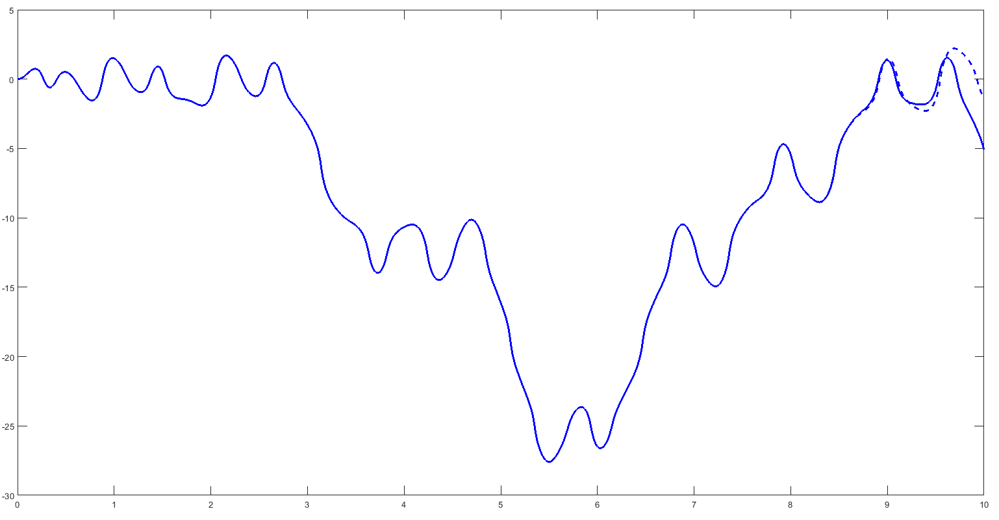

= Solutions to Exercise 1
:stem: latexmath
:source-highlighter: highlightjs
:highlightjs-languages: matlab

ifdef::env-github[]
:tip-caption: :bulb:
:note-caption: :information_source:
:important-caption: :heavy_exclamation_mark:
:caution-caption: :fire:
:warning-caption: :warning:
endif::[]

These solutions are from previous iterations of the course.  They have been
updated to reflect this year's iteration of the problem set.

== Problem 1.2

[start=2]
. See provided Simscape solution files.
** link:Solution_1_2_2_new_model.slx[]
** link:Solution_1_2_2_simple_link.slx[]
** link:Solution_1_2_2_simple_pendulum.slx[]
** link:Solution_1_2_2_simple_pendulum_analysis.slx[]

.. For the model to represent HDPE, the material density of the simple link has
to change to about stem:[950 \frac{kg}{m^3}].  See provided Simscape solution
file. With no torque input or damping, the equations of motion do not depend on
the mass of the link and, hence, the motion does not change.
*** link:Solution_1_2_2a_HDPE.slx[]

.. See provided Simscape solution file.
*** link:Solution_1_2_2b_Moon.slx[]

== Problem 1.3

. See provided Simscape solution file. After running the model, you can
generate the plots by executing this Matlab line: 
+
[source, matlab]
plot(q1); hold on; plot(w1);.
+
** link:Solution_1_3_1_DoublePendulum.slx[]
** link:Solution_1_3_1_DoublePendulum.png[]

. See provided Simscape solution file. The formulas for the inertia properties
can be found in the Inertia properties of the Solids. Note that, because
stem:[L], stem:[W], and stem:[H] are defined in centimeters but the inertia
properties in kilograms and meters, stem:[L], stem:[W], and stem:[H] have to be
scaled to meters in all expressions.
** link:Solution_1_3_2_DoublePendulum_ManualParameters.slx[]

. See provided Simscape solution file.
** link:Solution_1_3_3_DoublePendulum_input.slx[]

NOTE: The caveat lies in the chaotic behavior of a double pendulum. Tiny
changes in parameters or initial conditions can create large effects over time.
To give an example: In the solution file for Problem 1.3.2, we conducted the
scaling to meters individually for each stem:[L], stem:[W], and stem:[H]
everywhere where these variables appeared in the Inertia properties. Instead,
for each formula, one may also factor out all scaling coefficients and scale
the entire formula by a single coefficient. For example, the expression for
Mass would then become stem:[L*W*H*\rho/10^6]. Due to sensitivity of the
system, the numerical difference between the two approaches is enough to lead
to a different behavior for longer simulation times. The deviations are not
visible during a 5 second simulation but become more apparent after 10
seconds, as shown in Figure 1.3 (both lines in the figure show the angle
between the links; the solid line corresponds to individual scaling of each
linear dimension and the dashed line to scaling of each inertia property with
a single coefficient). 

.Full 10 second motion of the double pendulum

== Problem 1.4

. A four-bar linkage is a single degree-of-freedom mechanism. Therefore, no
more than one joint angle (state target) can be specified so that the initial
configuration is valid. Simscape checks for this and returns an error if more
than one state target is specified.  However, you can suppress this error in
the Simscape settings (Simulation->Model configuration Parameters->Simscape
Multibody->Diagnostics). If you do this and run the model with all joint state
targets set to 0, Simscape will find a configuration `close’ to the desired one
and return a warning that not all state targets have been met.
** link:Solution_1_4_1_4BarLinkage.slx[]

. See provided Simscape solution file. The position target of the first joint
is set to stem:[\arccos(\frac{0.15}{0.2})]. Note that while the specified initial
configuration is theoretically balanced, the mechanism loses balance after a
few seconds due to numerical errors and starts an oscillatory motion.
** link:Solution_1_4_2_4BarLinkage_balanced.slx[]
** link:Solution_1_4_2_4BarLinkage_balanced.bmp[]

. Because the length of each link is 0.2, the two end points cannot be more
than 0.6 m apart. The specified Rigid Transform corresponds to an impossible
linkage, regardless of the specified joint state targets. Hence, Simscape
cannot approximate such configuration by `tuning’ the state target values and
returns an error.
** link:Solution_1_4_3_4BarLinkage_OutOfRange.slx[]

== Problem 1.5

In this model, there is no solid object (with non-zero mass) between the
revolute joint (Revolute Joint 1 in the model) and the spherical joint. This
leads to non-deterministic accelerations in these joints about the common axis
of rotation. Adding a small mass would resolve the error.

Notice the torque input to the revolute joint between the Solids that is
coupled to the angle rate at the other joint. This torque provides energy input
or damping to the model and, hence, the system is not energetically
conservative.

* link:Solution_1_5_ErrorSystem.slx[]
* link:Solution_1_5_ErrorSystem_fixed.slx[]
